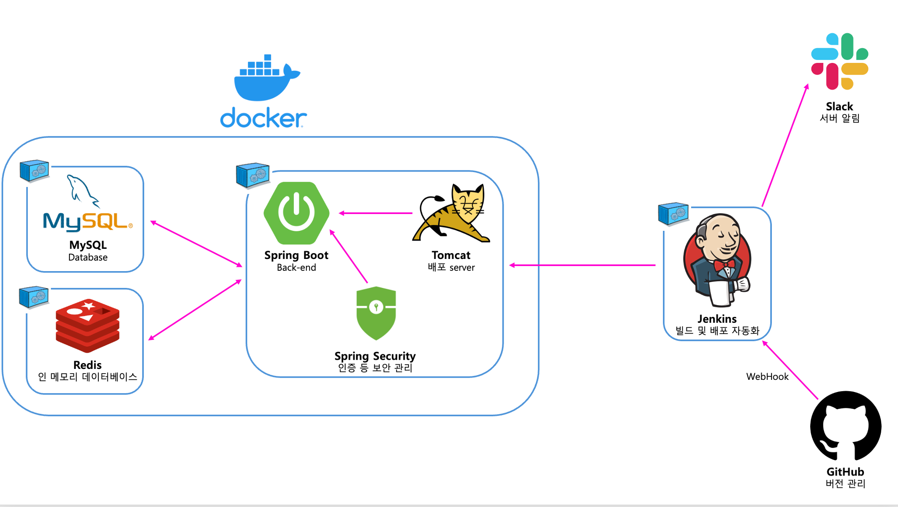
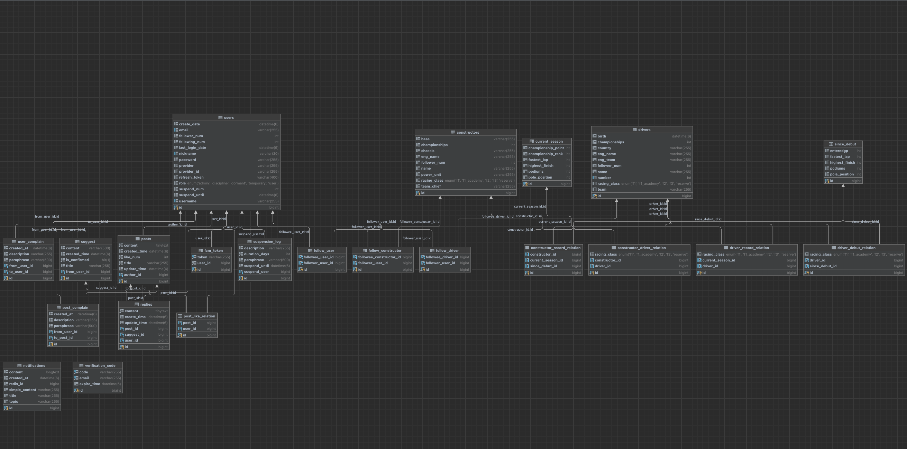

# 🏎️ F1FS

F1 Fan State Of Korea(한국 F1 레이싱 팬들을 위한 정보 제공 및 커뮤니티 사이트)

## 🏁 프로젝트 개요(프로젝트 동기)

F1FS는 F1 레이싱에 대한 팬심으로 시작된 프로젝트입니다.

F1은 국내에서 비인기 스포츠로 분류되며, 이로 인해 F1과 관련된 정보를 쉽게 얻을 수 있는 곳이 거의 없습니다. 또한 공용 커뮤니티를 제외하면 F1을 좋아하는 사람들끼리 자유롭게 소통할 수 있는 공간도 부족합니다. 국내에서는 F1 정보를 얻기 위해 구글링에 의존할 수밖에 없는 현실입니다.

이에 한국에서도 F1 정보를 손쉽게 접하고, F1 팬들이 서로 소통할 수 있는 **F1 전용 커뮤니티 사이트**를 제작하기 시작했습니다.

본 프로젝트는 **Spring Boot**와 **Spring Security**를 기반으로 제작되었으며, 컴퓨터공학 전공자 또는 스프링 부트를 활용해 유사한 서비스를 개발하려는 분들에게 참고가 될 수 있도록 오픈 소스로 개발 중 입니다.

## 🧑🏻‍💻 프로젝트 시스템

F1FS는 F1 레이스에 대한 정보와 사용자들 간의 커뮤니케이션을 지원하는 F1 전용 커뮤니티 사이트 서비스를 제공합니다. 

- **드라이버와 컨스트럭터** : F1 레이스에 참여하는 드라이버와 컨스트럭터(팀)에 대한 기본 정보 및 현재 시즌 성적 등을 제공합니다. 
- **게시글 서비스** : 사용자들은 게시글을 작성할 수 있으며 좋아요와 댓글을 받을 수 있습니다. 
- **팔로우 서비스** : 사용자-사용자, 사용자-드라이버, 사용자-컨스트럭터 간의 팔로우가 가능하며 팔로우하는 드라이버, 컨스트럭터, 사용자의 정보를 보다 쉽게 파악할 수 있습니다. 
- **검색 최적화** : 사용자들이 본인이 원하는 정보를 빠르게 찾을 수 있도록 최적화된 검색을 제공합니다. 
- **다양한 소셜 로그인** : 자체 로그인을 제외한 구글, 네이버, 페이스북 등 다양한 소셜 로그인을 지원합니다. 
- **그랑프리 관련 서비스(💻개발 중...💻)** : 각 그랑프리에 대한 정보(서킷, 우승자, 레이스 결과 등)를 제공합니다. 
- **쪽지 및 채팅(💻개발 중...💻)** : 사용자 간에 게시글을 제외한 활발한 소통을 위해 쪽지 및 오픈 채팅을 제공합니다. 

## 📦 프로젝트(패키지) 구조
```markdown
app/
├── domain/
│   ├── application/
│   │   ├── mapper/ (엔터티 <-> DTO, DTO <-> 엔터티, 매핑 클래스)
│   │   ├── port/
│   │   │   ├── in/ (UseCase)
│   │   │   └── out/ (Port)
│   │   └── service/ (도메인 서비스)
│   ├── domain/ (도메인 엔터티)
│   ├── infrastructure/
│   │   ├── adapter/ (어댑터 구현체)
│   │   └── repository/ (레포지토리)
│   └── presentation/
│   │   ├── controller/ (컨트롤러)
│   │   └── dto/ (DTO)
└── global/
    ├── application/
    │   ├── port/
    │   │   ├── in/
    │   │   └── out/
    │   └── service/
    ├── config/ (각종 서버 환경 설정)
    ├── presentation/
    │   └── dto/
    └── util/ (각종 유틸 클래스)
```

## 🏛️ 아키텍처 특징
이 프로젝트는 **헥사고날 아키텍처(Hexagonal Architecture)**, 즉 **포트 & 어댑터(Ports & Adapters) 패턴**을 기반으로 설계되었습니다.

- **도메인 중심 설계(Domain-Driven Design)** 를 기반으로 각 도메인을 독립적으로 구성하고, 비즈니스 로직과 외부 의존성을 분리했습니다.
- 도메인 서비스는 **포트(Port) 인터페이스**를 통해 의존성을 선언하고, 실제 구현은 **어댑터(Adapter)** 에서 처리하여 의존성을 역전시켰습니다.
- 이를 통해 비즈니스 로직이 외부 환경에 의존하지 않고, **유지보수성을 극대화**했습니다.

### domain

- **application** : 도메인 로직을 조율하는 서비스 계층으로, UseCase 인터페이스와 구현체를 통해 프레젠테이션과 도메인 사이의 흐름을 관리합니다.
    - **mapper** : 엔터티 ↔ DTO 간 변환을 담당하는 매핑 클래스가 위치합니다.
    - **port** : 의존성을 조율하는 계층으로 UseCase 인터페이스를 정의하고 도메인의 외부(컨트롤러 등)에서 호출할 수 있는 서비스 계약을 선언하는 **in**패키지와 Port 인터페이스를 정의하고 외부 인프라에 대한 의존성을 추상화하는 **out**패키지로 나뉩니다.
    - **service** : 도메인 비즈니스 로직을 담은 서비스 클래스로 UseCase 구현체 역할을 수행합니다.
- **domain** : 해당 도메인의 엔터티와 애그리거트 루트 등 핵심 도메인 모델이 존재하는 계층입니다. 
- **infrastructure** : 포트의 구현체인 Adapter와 영속성 처리를 담당하는 Repository가 포함된 계층입니다. 
    - **adapter** : Port 인터페이스를 구현하여 실제 외부 시스템과 연결되는 어댑터 클래스가 위치합니다. 
    - **repository** : JPA/Hibernate 등의 영속성 구현체로 Repository 인터페이스 혹은 Spring Data JPA 레포지토리 클래스가 위치합니다. 
- **presentation** : 사용자의 요청과 응답을 처리하는 컨트롤러와 DTO가 존재하는 계층입니다. API 엔드포인트를 제공하며, 요청을 UseCase 또는 Service에 전달하고 결과를 반환합니다. 
    - **controller** : HTTP API 요청을 처리하는 컨트롤러 클래스가 위치합니다.
    - **dto** : 클라이언트와 데이터를 교환하기 위한 요청/응답 DTO 클래스가 위치합니다.

### global

- **application** : 
  - **port/in, port/out** : 여러 도메인에서 공통으로 사용할 수 있는 UseCase, Port 인터페이스가 위치합니다.
  - **service** : 공통 기능(유효성 검사, Slack 관련 등) 서비스 클래스가 위치합니다.
- **config** : 서버, 보안, Swagger, JPA, Email, Redis 등 전역 설정 파일들이 위치합니다.
- **presentation/dto** : 여러 도메인에서 공유할 수 있는 전역 공통 DTO 클래스들이 위치합니다.
- **util** : 프로젝트 전역에서 활용할 각종 유틸리티 클래스들이 위치합니다.

## 🏛️ 개발 환경 구조도(ver.BE)


## 🧬 Table Tree 구조도(MySQL)


## 🤙🏻 Contact to Developer

📧 dudwnszero99@gmail.com
